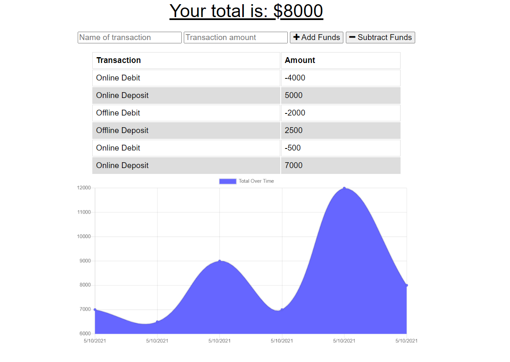

# BudgetTracker
## 
## Description 
The Budget Tracker app enables users to enter debits and credits to an account. 

The app tracks and graphs the transactions. The app allows for online work with storage in Mongo/Atlas DB 

and  offline work through the use of indexedDB and cache. The app can be installed as a PWA (progressive web app) 

through the use of a service worker and web manifest. The app is deployed on Heroku: https://budgets-all-the-time.herokuapp.com/
## Table of Contents
- [Installation](#installation)
- [Usage](#usage)
- [Screenshot](#screenshot)
- [Deployed_Link](#deployed_link)
- [License_Details](#license_details)
- [Contributing](#contributing) 
- [Tests](#tests)
- [Questions](#questions)
## Installation
To install the necessary dependencies run:

npm i

Install the app locally by running npm i to install dependencies. Then run npm start to start the app. 

To run the deployed version use the link: https://budgets-all-the-time.herokuapp.com/
## Usage
To launch the app follow the link: https://budgets-all-the-time.herokuapp.com/. 

To use the app enter transaction descriptions and the amount to debit or credit. Click Add Funds or Subtract Funds. 

The application words online and offline.

## Screenshot

## Deployed_Link
[Deployed Link](https://budgets-all-the-time.herokuapp.com/)
## License_Details

This project is licensed through: MIT

## Contributing

Coleen Stuhlfire

## Tests

Run the application and enter transactions. 

Run the app with the network off and then turn it back on to test the offline functionality.

## Questions

If you have questions about the repo, open an issue or contact me at 
cstuhlfire. You can find this project along with my other work 
at https://github.com/cstuhlfire.

